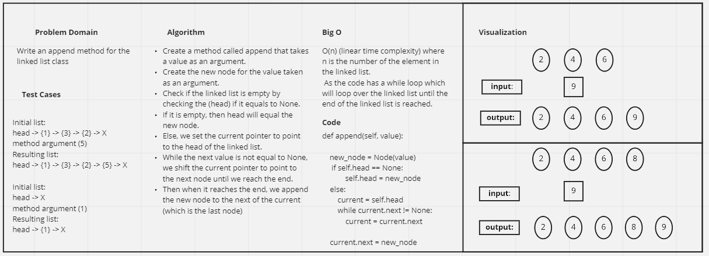

# Singly Linked List
<!-- Short summary or background information -->
Singly Linked List, has two pointers, pointing to the current and the next node.

## Whiteboard
> Whiteboard for the append method

## Challenge
<!-- Description of the challenge -->
This challenge requires building a linked list class, and adding methods to the linked list:
- insert >> for adding a node (value) to the beginning of the linked list
- includes >> which searches for a certain value in the linked list and return true if found or false if not
- to string >> which returns a string representing all the values in the linked list. 
- append >> adds a new node to the end of the linked list
- insert before >> insert the new node before a certain value (node) in the linked list
- insert after >> insert the new node after a certain value (node) in the linked list

## Approach & Efficiency
<!-- What approach did you take? Why? What is the Big O space/time for this approach? -->
The big O time complexity for depends on the method used, for example for the append method, it is
O(n), because a while loop was used to iterate over the linked list and reach the end of the linked list
to append the new node to the end.

## API
<!-- Description of each method publicly available to your Linked List -->
1. append >> adds a node to the END of the linked list, it iterates over the list until the last node is found,
and adds the new node after it.
2. inset >> adds a node to the beginning of the linked list.
3. includes >> iterates over the nodes in the liked list and returns true if the
required value exists and false if the value does not exist in the linked list.
4. to string >> returns a string representing all the values in the linked list
5. insert before >> insert the new node before a certain value in the linked list 
6. insert after >> insert the new node after a certain value in the linked list