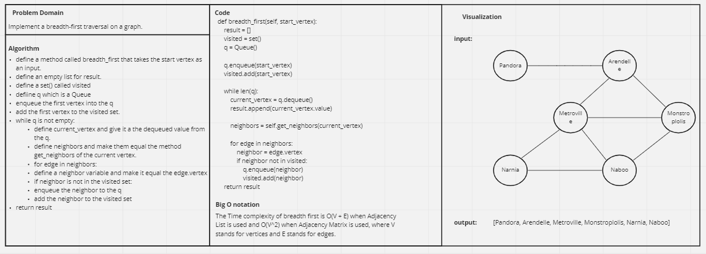

# Challenge Summary
<!-- Description of the challenge -->
Implement a breadth-first traversal on a graph.

## Whiteboard Process
<!-- Embedded whiteboard image -->

## Approach & Efficiency
<!-- What approach did you take? Why? What is the Big O space/time for this approach? -->

The Time complexity of BFS is O(V + E) when Adjacency List is used and O(V^2) when Adjacency Matrix is used, where V stands for vertices and E stands for edges.

## Solution
<!-- Show how to run your code, and examples of it in action -->
```commandline
    g = Graph()
    a = g.add_node('A')
    b = g.add_node('B')
    e = g.add_node('E')
    c = g.add_node('C')
    d = g.add_node('D')
    g.add_edge(a, b)
    g.add_edge(a, e)
    g.add_edge(a, c)
    g.add_edge(b, d)
    g.add_edge(b, e)
    g.add_edge(e, d)
    g.add_edge(e, c)

    print(g.breadth_first(a))
```