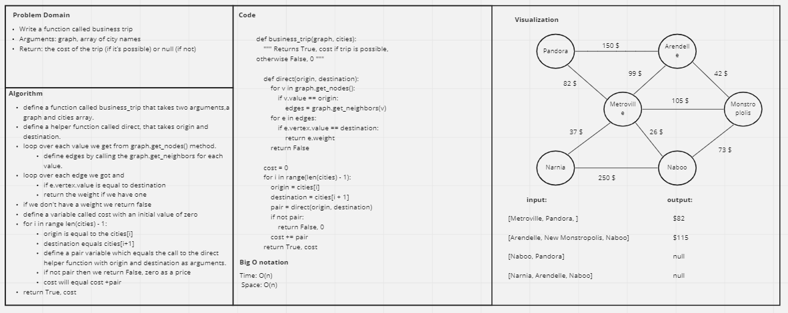

# Challenge Summary
<!-- Description of the challenge -->
Write a function called business trip

- Arguments: graph, array of city names
- Return: the cost of the trip (if it’s possible) or null (if not)
## Whiteboard Process
<!-- Embedded whiteboard image -->

## Approach & Efficiency
<!-- What approach did you take? Why? What is the Big O space/time for this approach? -->
Use a helper function to calculate the cost of a trip between a pair of locations. Returns the cost if the locations are connected, or False otherwise.

Since a trip may involve more than one location, iterate through the list of locations forming pairs in each iteration. Then call the cost helper function. If it returns False, then return False, 0. Otherwise, add the cost to the cost accumulator. Once all pairs have been evaluated, return True, cost accumulator.

Time: O(n) Space: O(n)


## Solution
<!-- Show how to run your code, and examples of it in action -->
```commandline
if __name__ == '__main__':

    my_graph = Graph()

    a = my_graph.add_node("a")
    b = my_graph.add_node("b")
    c = my_graph.add_node("c")
    d = my_graph.add_node("d")
    e = my_graph.add_node("e")
    f = my_graph.add_node("f")

    my_graph.add_edge(b, a, 1)
    my_graph.add_edge(b, d)
    my_graph.add_edge(b, e)
    my_graph.add_edge(b, c, 3)

    my_graph.add_edge(c, f, 5)

    print(direct_flights(my_graph , ["a", "b", "c", "f"]))
```