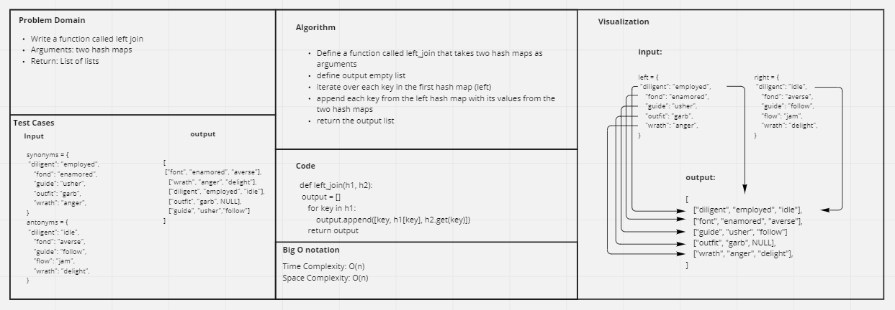

# Hashmap LEFT JOIN
<!-- Short summary or background information -->

## Challenge
<!-- Description of the challenge -->
Write a function that LEFT JOINs two hashmaps into a single data structure.

* Arguments: two hash maps
  * The left hashmap has word strings as keys, and a synonym as values
  * The right hashmap has word strings as keys, and an antonym as values
* Return: A data structure that holds the: key, synonym and antonym; If no values exist in the right hashmap, then append None to the result row
## Approach & Efficiency
<!-- What approach did you take? Why? What is the Big O space/time for this approach? -->
For each key in left hashmap append the key, value, and the value or None of the righ hashmap.

- The Big O space/time for this approach is O(n).

## Solution
<!-- Embedded whiteboard image -->
