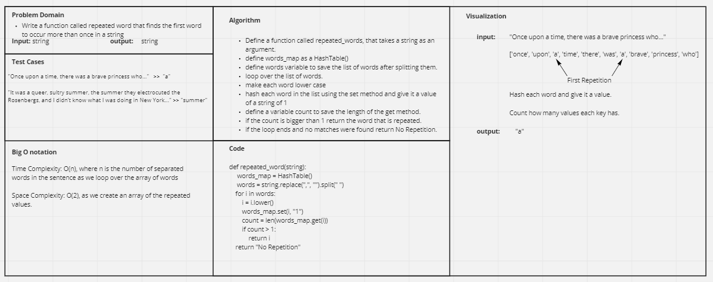

# Challenge Summary
<!-- Description of the challenge -->
Write a function called repeated word that finds the first word to occur more than once in a string
- Arguments: string
- Return: string

## Whiteboard Process
<!-- Embedded whiteboard image -->

## Approach & Efficiency
<!-- What approach did you take? Why? What is the Big O space/time for this approach? -->

- Time Complexity: O(n), where n is the number of separated words in the sentence as we loop over the array of words

- Space Complexity: O(2), as we create an array of the repeated values.

## Solution
<!-- Show how to run your code, and examples of it in action -->
```commandline
if __name__ == '__main__':
    str1 = "Once upon a time, there was a brave princess who..."
    str2 = "It was the best of times, it was the worst of times, it was the age of wisdom, it was the age of foolishness, it was the epoch of belief, it was the epoch of incredulity, it was the season of Light, it was the season of Darkness, it was the spring of hope, it was the winter of despair, we had everything before us, we had nothing before us, we were all going direct to Heaven, we were all going direct the other way – in short, the period was so far like the present period, that some of its noisiest authorities insisted on its being received, for good or for evil, in the superlative degree of comparison only..."
    str3 = "It was a queer, sultry summer, the summer they electrocuted the Rosenbergs, and I didn’t know what I was doing in New York..."
    r = repeated_word(str1)
    r2 = repeated_word(str2)
    r3 = repeated_word(str3)
    print(r)
    print(r2)
    print(r3)
```