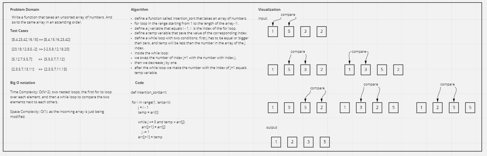

# Challenge Summary
<!-- Description of the challenge -->
Write the steps of the sorting insertion algorithm based on the pseudocode
provided and write.

## Whiteboard Process
<!-- Embedded whiteboard image -->


## Approach & Efficiency
<!-- What approach did you take? Why? What is the Big O space/time for this approach? -->

- Time Complexity: O(N^2), two nested loops, the first for to loop over each element, and then a while loop to compare the two elements next to each others.

- Space Complexity: O(1), as the incoming array is just being modified.

## Solution
<!-- Show how to run your code, and examples of it in action -->

```
if __name__ == '__main__':

    arr = [8,4,23,42,16,15]
    arr_2 = [20,18,12,8,5,-2]
    arr_3 = [5,12,7,5,5,7]
    arr_4 = [2,3,5,7,13,11]

    insertion_sort(arr)
    print(arr)
```
```
[4, 8, 15, 16, 23, 42] 
```