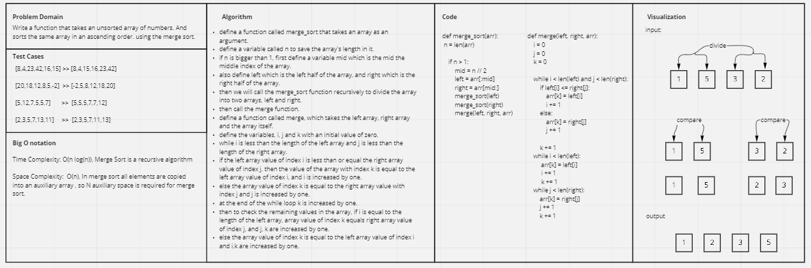

# Challenge Summary
<!-- Description of the challenge -->
Write the steps of the sorting merge algorithm based on the pseudocode
provided and write a blog.

## Whiteboard Process
<!-- Embedded whiteboard image -->


## Approach & Efficiency
<!-- What approach did you take? Why? What is the Big O space/time for this approach? -->

- Time Complexity: O(n log(n)), Merge Sort is a recursive algorithm

- Space Complexity: O(n), In merge sort all elements are copied into an auxiliary array , so N auxiliary space is required for merge sort.

## Solution
<!-- Show how to run your code, and examples of it in action -->

```
if __name__ == '__main__':
    arr1 = [8,4,23,42,16,15]
    merge_sort(arr1)
    print(arr1)
```
```
[4, 8, 15, 16, 23, 42] 
```