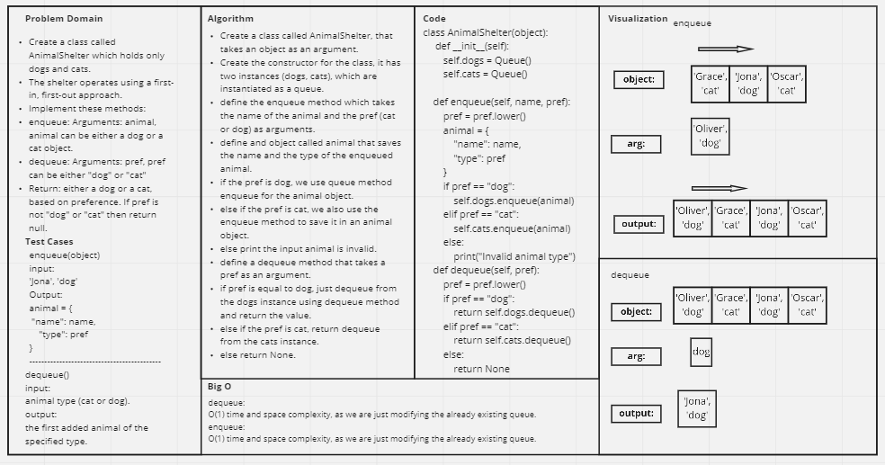

# Challenge Summary
<!-- Description of the challenge -->
Create a class called AnimalShelter which holds only dogs and cats.

The shelter operates using a first-in, first-out approach.

## Whiteboard Process
<!-- Embedded whiteboard image -->


## Approach & Efficiency
<!-- What approach did you take? Why? What is the Big O space/time for this approach? -->
I used the previous made Queue class to make two queues, one for dogs and one for cats.
and then just enqueue or dequeue from theses two queues.
## Solution
<!-- Show how to run your code, and examples of it in action -->
```
animal_shelter = AnimalShelter()
    animal_shelter.enqueue('Jona', 'dog')
    animal_shelter.enqueue('Grace', 'CAt')
    animal_shelter.enqueue('Rex', 'dog')
    animal_shelter.enqueue('Lena', 'dog')
    animal_shelter.enqueue('Oliver', 'cat')
    animal_shelter.enqueue('Emma', 'cat')
```
```
    print(animal_shelter.dequeue('cat'))
```
Output
```
    {'name': 'Grace', 'type': 'cat'}
```

```
    print(animal_shelter.dequeue('DOG'))
```
Output
```
{'name': 'Jona', 'type': 'dog'}
```