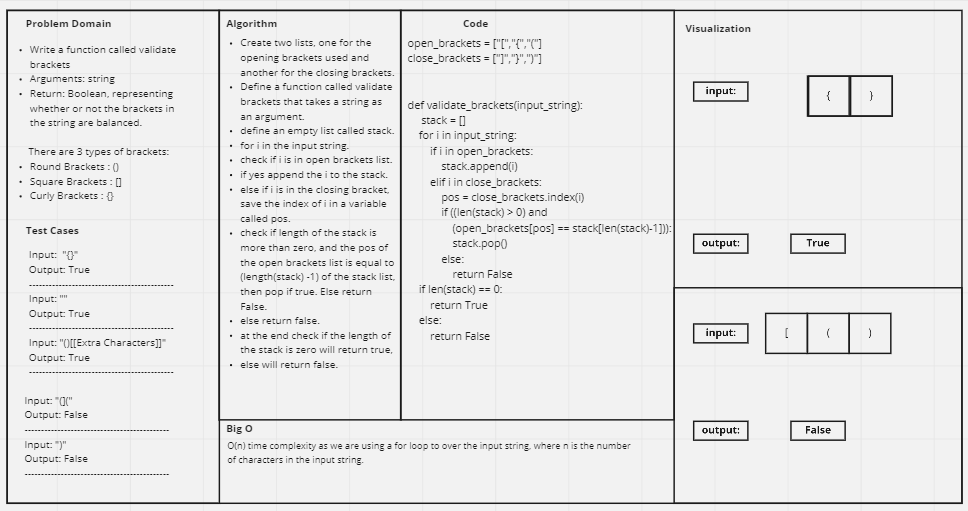

# Challenge Summary
<!-- Description of the challenge -->

Write a function called validate brackets

Arguments: string

Return: Boolean, representing whether or not the brackets in the string are balanced.

There are 3 types of brackets:
- Round Brackets : ()
- Square Brackets : []
- Curly Brackets : {}

## Whiteboard Process
<!-- Embedded whiteboard image -->


## Approach & Efficiency
<!-- What approach did you take? Why? What is the Big O space/time for this approach? -->
O(n) time complexity as we are using a for loop to over the input string, where n is the number of characters in the input string.

approach to check balanced parentheses is to use stack. Each time, when an open parentheses is encountered push it in the stack, and when closed parenthesis is encountered, match it with the top of stack and pop it. If stack is empty at the end, return True otherwise, False.


## Solution
<!-- Show how to run your code, and examples of it in action -->

```
    print(validate_brackets('{}'))  >> True
    
    print(validate_brackets('()[[Extra Characters]]	'))  >> True
    
    
    print(validate_brackets('{}{Code}[Fellows](())'))  >> True
    
    print(validate_brackets('[({}]'))  >> False

    print(validate_brackets(')'))  >> False
    
    print(validate_brackets('{(})'))  >> False
```