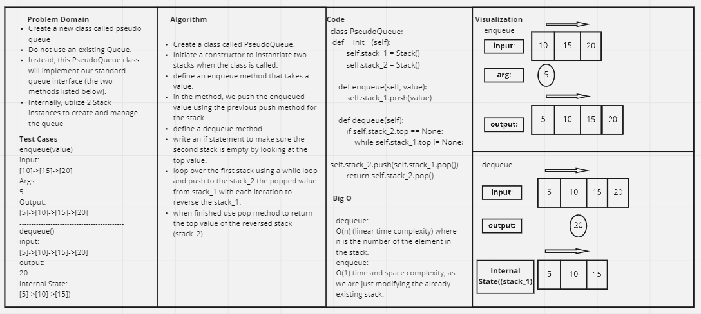

# Challenge Summary
<!-- Description of the challenge -->
Create a new class called pseudo queue.

Do not use an existing Queue.

Instead, this PseudoQueue class will implement our standard queue interface (the two methods listed below),

Internally, utilize 2 Stack instances to create and manage the queue
## Whiteboard Process
<!-- Embedded whiteboard image -->


## Approach & Efficiency
<!-- What approach did you take? Why? What is the Big O space/time for this approach? -->
> enqueue

O(1),
I used normal push to push the value to the top of the stack

> dequeue

O(n), where n is the number of elements in the first stack. Because we 
have to loop over the first stack to move the items in a reverse order to the second stack

## Solution
<!-- Show how to run your code, and examples of it in action -->

```
if __name__ == '__main__':
    stk_1 = PseudoQueue()
    
    # Adding nodes to the stack
    
    stk_1.enqueue(1)
    stk_1.enqueue(2)
    stk_1.enqueue(3)
    
    # display the output
    
    print(stk_1.stack_1.top.value)
    
    # pop from the stack
    # and save the popped value in a variable and print it
    
    a = stk_1.dequeue()
    print('a=', a)
```