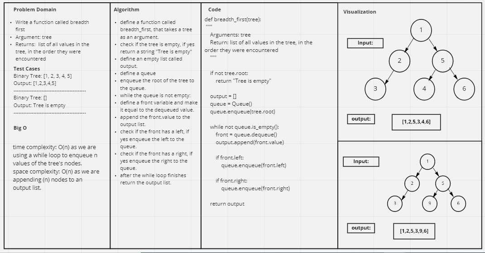

# Challenge Summary
<!-- Description of the challenge -->
- Write a function called breadth first
- Arguments: tree
- Return: list of all values in the tree, in the order they were encountered

## Whiteboard Process
<!-- Embedded whiteboard image -->


## Approach & Efficiency
<!-- What approach did you take? Why? What is the Big O space/time for this approach? -->

Time complexity: O(n) as we are using a while loop to enqueue n values of the tree's nodes.

Space complexity: O(n) as we are appending (n) nodes to an output list.

## Solution
<!-- Show how to run your code, and examples of it in action -->
```
    tree = BinaryTree()
    tree.root = TNode(1)
    tree.root.left = TNode(2)
    tree.root.right = TNode(3)
    tree.root.left.left = TNode(4)
    tree.root.left.right = TNode(5)
    tree.root.right.left = TNode(6)

    print(breadth_first(tree))
```