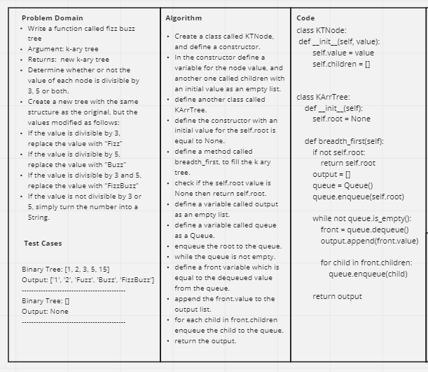
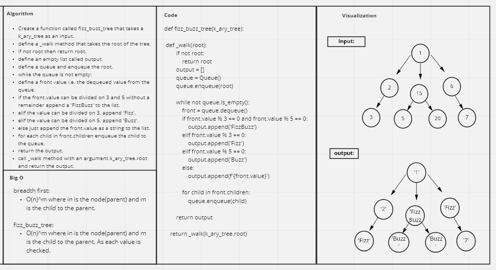

# Challenge Summary
<!-- Description of the challenge -->
- Write a function called fizz buzz tree
- Arguments: k-ary tree
- Return: new k-ary tree

Determine whether or not the value of each node is divisible by 3, 5 or both. Create a new tree with the same structure as the original, but the values modified as follows:

- If the value is divisible by 3, replace the value with “Fizz”
- If the value is divisible by 5, replace the value with “Buzz”
- If the value is divisible by 3 and 5, replace the value with “FizzBuzz”
- If the value is not divisible by 3 or 5, simply turn the number into a String.


## Whiteboard Process
<!-- Embedded whiteboard image -->



## Approach & Efficiency
<!-- What approach did you take? Why? What is the Big O space/time for this approach? -->
I used the breadth first approach to fill the k_ary_tree and the same aproach to walk over the tree's nodes
and find out which string should be added for each node value.

> BigO

breadth first:
O(n)^m where in is the node(parent) and m is the child to the parent.

fizz_buzz_tree:
O(n)^m where in is the node(parent) and m is the child to the parent. As each value is checked.

## Solution
<!-- Show how to run your code, and examples of it in action -->

```
if __name__ == "__main__":
    tree = KArrTree()
    tree.root = KTNode(1)
    # tree.root.children = KTNode([2, 3, 4])
    tree.root.children.append(KTNode(2))
    tree.root.children.append(KTNode(3))
    tree.root.children[0].children.append(KTNode(15))
    tree.root.children[1].children.append(KTNode(20))

    print(tree.breadth_first())

    print(fizz_buzz_tree(tree))
```