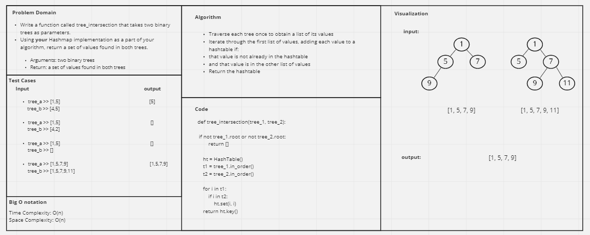

# Challenge Summary
<!-- Description of the challenge -->
Write a function called tree_intersection that takes two binary trees as parameters. Using your Hashmap implementation as a part of your algorithm, return a set of values found in both trees.

## Whiteboard Process
<!-- Embedded whiteboard image -->


## Approach & Efficiency
<!-- What approach did you take? Why? What is the Big O space/time for this approach? -->
The Binary Tree class has three similar traversing methods, (in_order) method was used to return a list of the values in the tree.

Traverse each tree once to obtain the list of its values. Iterate through the shortest list of values, adding each value to a hashtable if: that value is not already in the hashtable, and that value is in the other list of values Return the hashtable.

Time and space complexity: O(n)

## Solution
<!-- Show how to run your code, and examples of it in action -->
```
if __name__ == "__main__":
    b1_tree = BinaryTree()
    b2_tree = BinaryTree()

    b1_tree.root = TNode(150)
    b1_tree.root.left = TNode(100)
    b1_tree.root.left.left = TNode(75)
    b1_tree.root.left.right = TNode(160)
    b1_tree.root.left.right.left = TNode(125)
    b1_tree.root.left.right.right = TNode(175)
    b1_tree.root.right = TNode(250)
    b1_tree.root.right.left = TNode(200)
    b1_tree.root.right.right = TNode(350)
    b1_tree.root.right.right.left = TNode(300)
    b1_tree.root.right.right.right = TNode(500)

    b2_tree.root = TNode(42)
    b2_tree.root.left = TNode(100)
    b2_tree.root.left.left = TNode(15)
    b2_tree.root.left.right = TNode(160)
    b2_tree.root.left.right.left = TNode(125)
    b2_tree.root.left.right.right = TNode(175)
    b2_tree.root.right = TNode(600)
    b2_tree.root.right.left = TNode(200)
    b2_tree.root.right.right = TNode(350)
    b2_tree.root.right.right.left = TNode(4)
    b2_tree.root.right.right.right = TNode(500)

    print(tree_intersection(b1_tree, b2_tree))
```