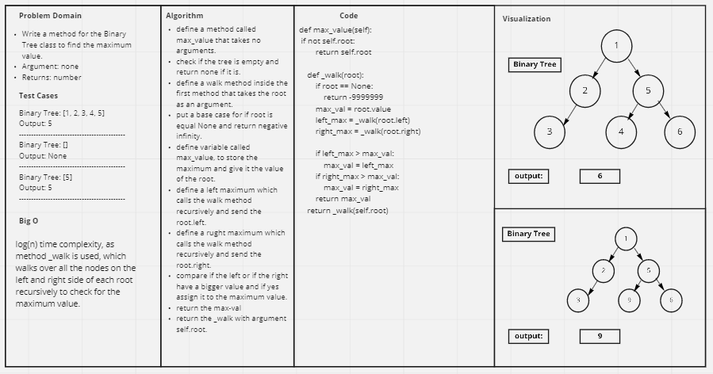

# Challenge Summary
<!-- Description of the challenge -->

find maximum value

- Arguments: none
- Returns: number

## Whiteboard Process
<!-- Embedded whiteboard image -->


## Approach & Efficiency
<!-- What approach did you take? Why? What is the Big O space/time for this approach? -->
log(n), as walk is used to compare the left and right sides of a tree.
## Solution
<!-- Show how to run your code, and examples of it in action -->

```
tree = BinaryTree()
    tree.root = TNode(1)
    tree.root.left = TNode(2)
    tree.root.right = TNode(5)
    tree.root.left.left = TNode(3)
    tree.root.left.right = TNode(4)
    tree.root.right.left = TNode(6)

    print(tree.max_value())
```